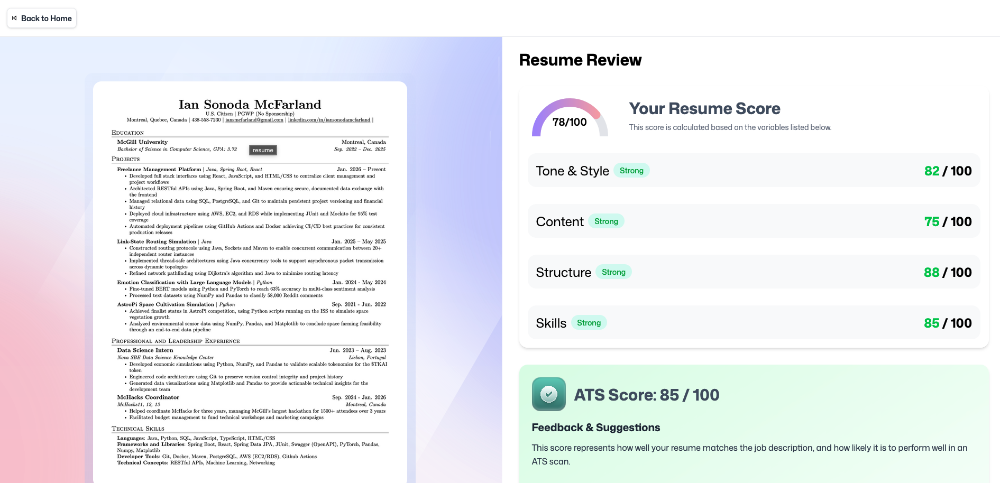
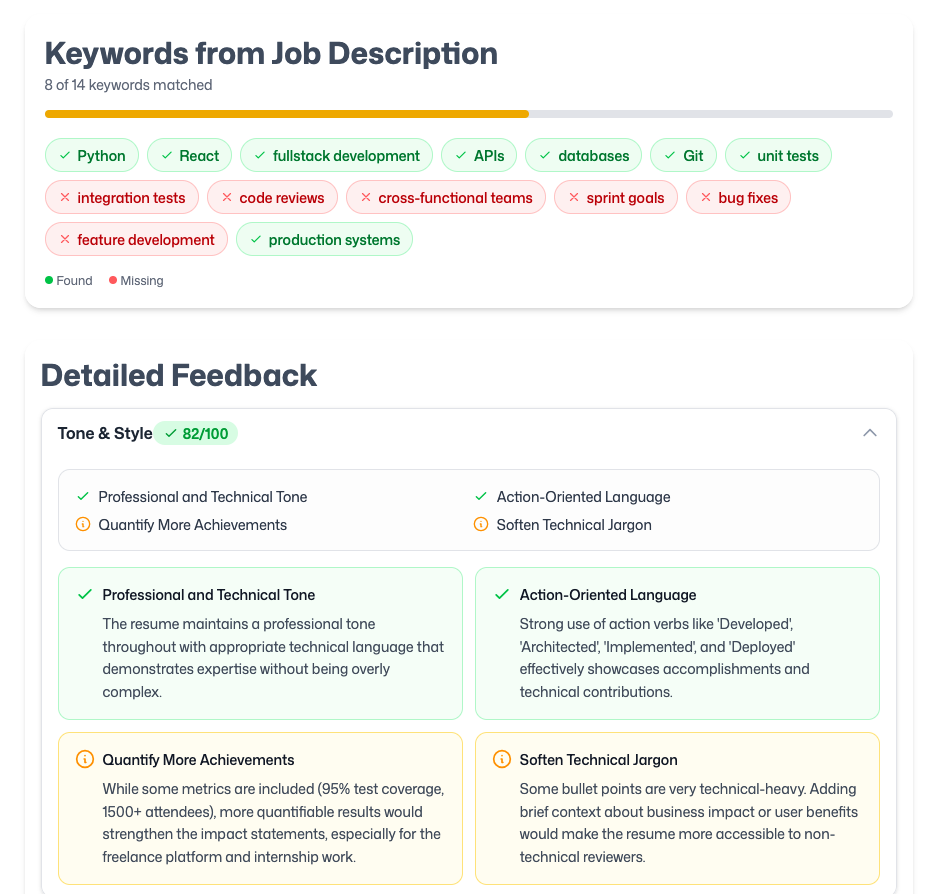
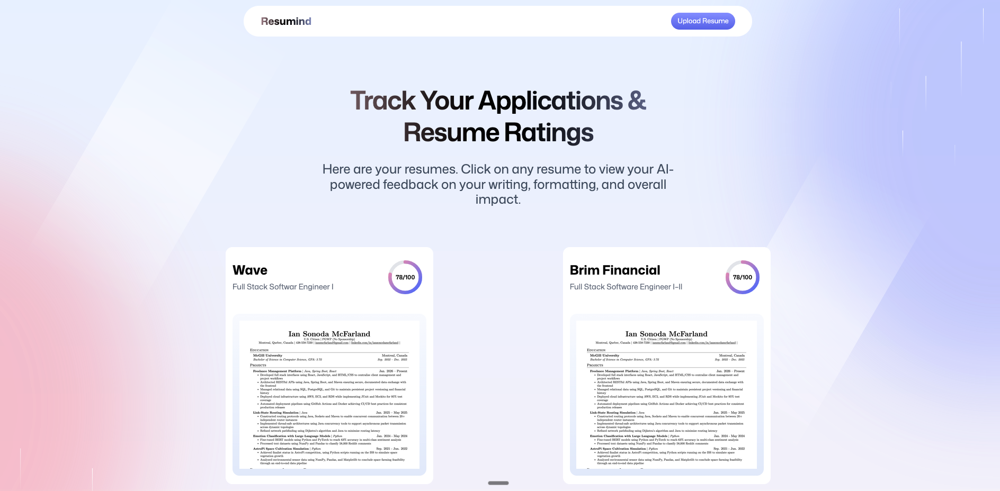

# 🚀 AI Resume Analyzer

<p align="center">
  
  
</p>
<p align="center">
  
</p>

**Transform your resume from a document into a career-launching asset.** The **AI Resume Analyzer** leverages state-of-the-art AI to provide deep insights, ATS scoring, and targeted feedback—helping you land more interviews by matching your profile with your dream job's requirements.

---

## 💎 Key Features

- **🧠 Intelligent AI Analysis**: Powered by [Puter.js](https://puter.com/), our analyzer deep-scans your resume against specific job descriptions to provide professional-grade feedback.
- **📊 ATS Scoring Engine**: Get a precise "Applicant Tracking System" score and learn exactly how to bypass automated filters.
- **🔍 Strategic Keyword Extraction**: Automatically extracts 8-15 critical keywords and skills from any job description and checks for their presence in your resume.
- **✨ Targeted Feedback Categories**:
  - **Tone & Style**: Ensures your professional voice matches the industry standards.
  - **Content & Impact**: Improves your bullet points for maximum impact.
  - **Structure & Formatting**: High-level advice on layout and readability.
  - **Skill Gap Analysis**: Identifies what's missing for a perfect match.
- **🖼️ Visual Insights**: Interactive gauges, progress circles, and keyword badges for intuitive data visualization.
- **🔒 Privacy-First Storage**: Secure, decentralized file storage and KV management via Puter's cloud infrastructure.

---

## 🛠️ Tech Stack

- **Framework**: [React Router 7](https://reactrouter.com/) (Full-stack React)
- **Styling**: [Tailwind CSS v4](https://tailwindcss.com/) + [tw-animate-css](https://github.com/thefubuki/tw-animate-css)
- **AI/Cloud**: [Puter.js](https://puter.com/) (AI, FS, KV storage)
- **PDF Processing**: [pdfjs-dist](https://github.com/mozilla/pdf.js)
- **State Management**: [Zustand](https://github.com/pmndrs/zustand)
- **Icons**: [Lucide React](https://lucide.dev/) (implied/style-matched)

---

## 🚀 Getting Started

### Prerequisites

- [Node.js](https://nodejs.org/) (v18 or higher)
- [Puter.js Account](https://puter.com/) (for cloud features)

### Installation

1. Clone the repository:

   ```bash
   git clone https://github.com/iansonoda/ai-resume-app.git
   cd ai-resume-app
   ```

2. Install dependencies:
   ```bash
   npm install
   ```

### Development

Start the development server with Hot Module Replacement (HMR):

```bash
npm run dev
```

Your application will be available at `http://localhost:5173`.

### Production Build

Create an optimized production bundle:

```bash
npm run build
npm run start
```

---

## 🏗️ How It Works

1.  **Upload & Home**: Manage all your applications from a central dashboard. Drag and drop your PDF resume to start a new analysis.
    
2.  **AI Analysis**: Our engine scans both documents, matching skills, extracting keywords, and assessing structural quality.
3.  **Review Dashboard**: Get a comprehensive breakdown of improvements, scores, and missing keywords.
    
4.  **Keyword Matching**: See exactly which skills are missing and how to improve your match rate.
    

---

## 🛡️ License

This project is licensed under the MIT License - see the [LICENSE.md](LICENSE.md) file for details.

---

Built with ❤️ for career growth. 🚀
